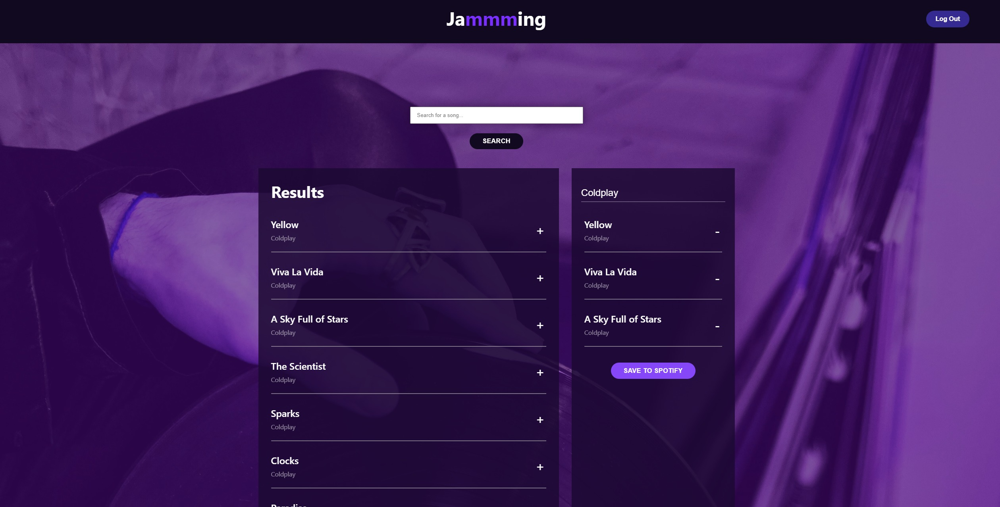

# CC Spotify Jammming Project


## Description

This is Adrian Jimenez's Spotify Jammming project submission.

This project is a single page react application that allows the user to interface with the spotify api to create a playlist, add tracks to it, and save it to their account.

## Table of Contents

- [Installation](#installation)
- [Languages](#languages)
- [Usage](#usage)
- [Credits](#credits)
- [License](#license)
- [Contributing](#contributing)
- [Questions](#questions)

## Installation

In order to install this project, download all files and have node.js installed on your machine. Navigate to the root directory and type:

    npm install

Once all dependencies have been downloaded, you can start the application by typing npm start

## Technologies Used

- JavaScript
- Node.JS
- React
- CSS
- HTML
- Jest
- React testing library

## Usage



In order to use this project, please make sure you have node.js intalled on your machine.

**IMPORTANT**

It's important to note that you MUST place your spotify api client credentials in a .env file located at the root of the project. Make sure to add these as follows:

```
REACT_APP_CLIENT_ID = "<Your client id>"
REACT_APP_REDIRECT_URL = "<Your redirect URL>"
```

Please note that the redirect url changes depending on your localhost port and which redirect url you specified using the spotify api dashboard.

Once that is set up, simply execute npm start and the application should start.

## Credits

- Adrian Jimenez

## License

This project is licensed under the MIT License. See [LICENSE.md](./LICENSE.md) for more details.

---

## Contributing


This project follows the contributor covenant contribution guidelines. See [here](https://www.contributor-covenant.org/version/2/1/code_of_conduct/)

## Questions

If you have any questions or concerns visit my [github](https://github.com/PuppetAJ) or send me an email at <adrianjimenez1950@gmail.com>.
